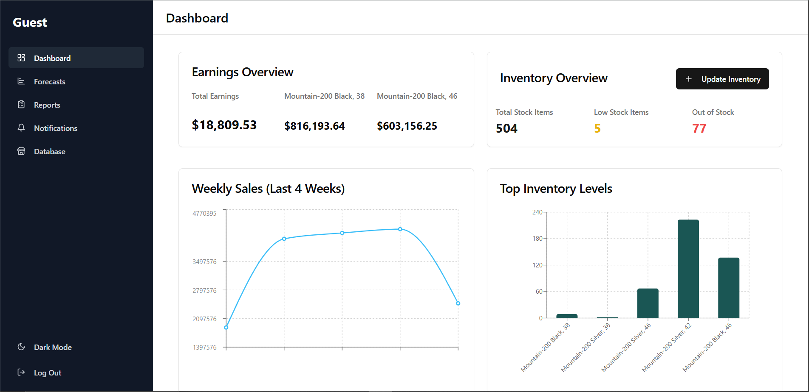
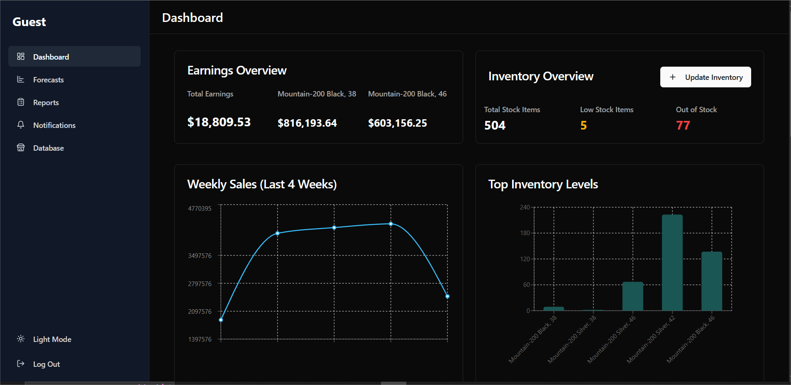

# AI-Driven-Retail-Dashboard
An intelligent and scalable retail analytics platform built to give real-time insights, predictions, and actionable intelligence to retailers. This platform enables seamless database integration, on-the-fly analytics, and AI-powered forecasting — all from a responsive web interface.

## 🚀 Live Demo

Coming soon...

---

## 📸 Screenshots

| Desktop View | Mobile View | Dark Mode |
|--------------|-------------|-----------|
|  |  |  |

> Replace these image links with actual URLs or relative paths in your repo.

---

## 📦 Features

### ✅ Real-time Inventory Dashboard
- Connect your **MySQL** database to get real-time inventory insights.
- View stock distribution, sales trends, and client breakdowns instantly.

### 🔮 AI-Powered Sales Forecasting
- Upload your dataset and get **next-week sales predictions** using machine learning.
- Download auto-generated **PDF reports** with graphs, metrics, and insights.

### 🛒 Market Basket Analysis (MBA)
- Upload transactional data to uncover **product affinities**, communities, and rules.
- Visualize frequently bought together items and strategic bundles.

### 📊 Automated ML Reporting
- The system auto-generates clean PDF reports for:
  - Sales Forecasting
  - MBA Analysis

### ✍️ Frontend-Based Inventory Management
- Update stock values directly from the **dashboard UI** — no MySQL command-line needed!

### 🔔 Low Stock Notifications
- Get **real-time alerts** when your stock goes below a defined threshold.

### ⚡ Real-Time Updates
- Uses **Socket.IO** for instant sync of data between frontend and backend.

### 📱 Fully Responsive UI
- Built with **React**, **Tailwind CSS**, and **ShadCN UI**.
- Works beautifully on **desktop**, **tablet**, and **mobile** screens.
- Includes **dark mode support**.

---

## 🧠 Tech Stack

### Frontend
- React (18+)
- Tailwind CSS
- ShadCN UI
- Recharts (visualization)
- Socket.IO Client

### Backend
- Node.js + Express
- Socket.IO
- MySQL / PostgreSQL / MSSQL / OracleDB support
- MongoDB Atlas (for storing user and app data)
- REST API + real-time event layer

### Machine Learning
- Flask APIs hosted separately
- Trained ML models for:
  - Time-series sales forecasting
  - Market basket analysis
- Receives dataset from backend, returns downloadable PDF reports

---
---

---

## 🖼️ Project Gallery

Here’s a visual overview of the key features and responsive design of the AI Driven Retail Dashboard.

<p float="left" align="center">
  
  
</p>

<p float="left" align="center">
  
  
</p>

<p float="left" align="center">
  
  
</p>


## 🗂️ Project Structure

```bash
/AI-Retail-Dashboard
  /frontend   # React + Tailwind + Vite app
  /backend    # Node + Express + Mongo + MySQL connector
  /mba        # Flask API for mba analysis
  /sales_forecasting # Flask API for sales forecasting